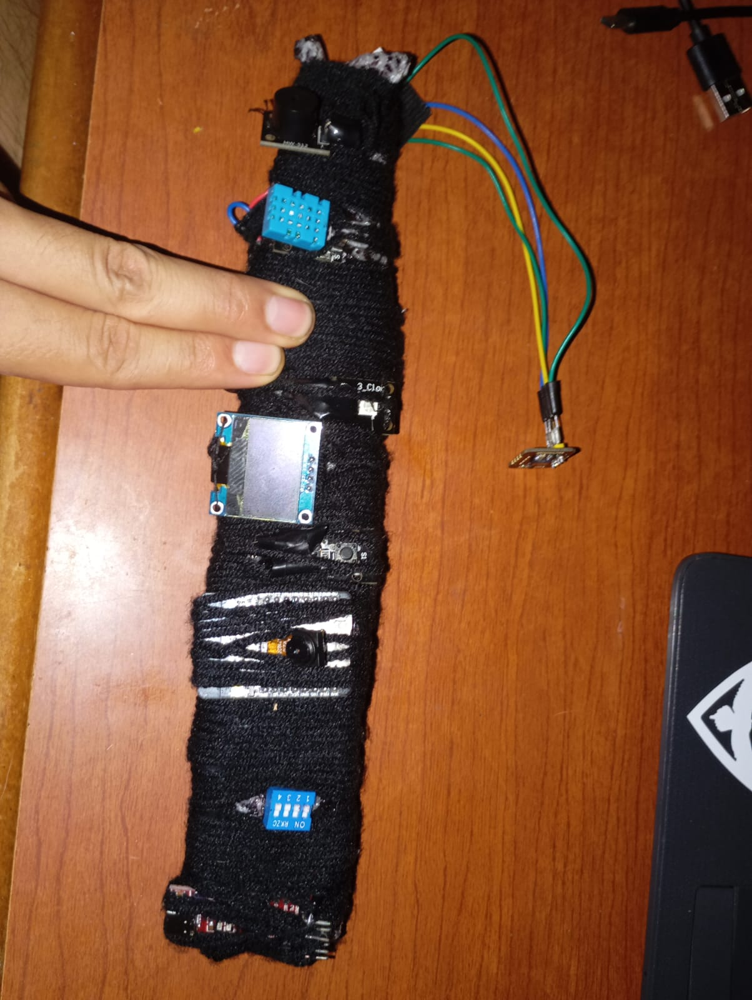

# Brazalete de Monitoreo de Salud con ESP32

Un sistema de monitoreo de signos vitales en tiempo real usando ESP32, sensores MAX30102 y DHT11, con integración a Firebase, Telegram y MQTT, ademas tiene ESP-CAM.

- boot.py es el archivo que se agrega a la camara
- medidor_bpm_y_oxigeno.py es el archivo que se corre al brazalete

## Tabla de Contenidos
- [Características Principales](#características-principales)
- [Hardware Requerido](#hardware-requerido)
- [Diagrama de Conexiones](#diagrama-de-conexiones)
- [Configuración](#configuración)
- [Instalación](#instalación)
- [Uso](#uso)
- [Interfaz Web](#interfaz-web)
- [Personalización](#personalización)
- [Esp-cam](#esp-cam)

## Características Principales
- Monitoreo continuo de frecuencia cardíaca (BPM)
- Medición de oxigenación sanguínea (SpO2)
- Lectura de temperatura y humedad ambiental
- Alertas inteligentes basadas en actividad
- Notificaciones por Telegram
- Visualización en pantalla OLED
- Interfaz web en tiempo real
- Almacenamiento en Firebase
- Se utiliza el protocolo MQTT
- CAM-ESP

## Hardware Requerido
| Componente | Cantidad | Descripción |
|------------|----------|-------------|
| ESP32 | 1 | Microcontrolador principal |
| MAX30102 | 1 | Sensor de frecuencia cardíaca y SpO2 |
| DHT11 | 1 | Sensor de temperatura/humedad |
| Pantalla OLED 128x64 | 1 | Visualización de datos |
| LED RGB | 1 | Indicador de estado |
| Buzzer pasivo | 1 | Alarma sonora |
| Pulsador | 1 | Botón de emergencia |
| Resistencias 220Ω | 3 | Para LEDs |
| Protoboard | 1 | Para conexiones |

## Diagrama de Conexiones

#### ESP32 Pin   Componente
--------   -----------
- GPIO22     MAX30102 SCL
- GPIO21     MAX30102 SDA
- GPIO16     OLED SCL
- GPIO17     OLED SDA
- GPIO18     DHT11 Data
- GPIO13     LED Rojo (+220Ω)
- GPIO12     LED Verde (+220Ω)
- GPIO14     LED Azul (+220Ω)
- GPIO15     Buzzer
- GPIO25     Pulsador (Pull-down)
- GND        Tierra común
- 3.3V       Alimentación sensores 

## Configuración
    Requisitos de software:
        Micropython 1.19+ en ESP32
        Librerías necesarias:
            max30102.py
            ssd1306.py
            dht.py
            umqtt.simple
            urequests
    Configura credenciales:
python

### WiFi
ssid = "TU_RED_WIFI"
password = "TU_CONTRASEÑA"

### Telegram
token = 'TU_TOKEN_BOT_TELEGRAM'
chat_id = 'TU_CHAT_ID'

### Firebase
FIREBASE_URL = 'https://tufirebase.firebaseio.com/'
API_KEY = 'TU_API_KEY_FIREBASE'

### MQTT
MQTT_BROKER = "IP_SERVIDOR_MQTT"
MQTT_PORT = 1883

# Instalación
    Flashea Micropython en tu ESP32 usando esptool
    Sube los archivos:

>bash
> - ampy -p /dev/ttyUSB0 put main.py
> - ampy -p /dev/ttyUSB0 put ssd1306.py
> - ampy -p /dev/ttyUSB0 put max30102.py
> -    Conecta los componentes según el diagrama
> -    Reinicia el ESP32

# Uso

    Conecta el brazalete al paciente
    Los datos se mostrarán en la OLED
    La interfaz web mostrará los datos en tiempo real
    En emergencias:
        Sonará el buzzer
        LED se pondrá rojo
        Se enviará alerta por Telegram

# Interfaz Web
Para implementar:

    Coloca los archivos HTML/JS en un servidor web
    Configura Firebase en index.html
    Asegura acceso al broker MQTT

javascript

    // Ejemplo de configuración Firebase
    const firebaseConfig = {
    apiKey: "TU_API_KEY",
    authDomain: "TU_PROYECTO.firebaseapp.com",
    databaseURL: "https://TU_PROYECTO.firebaseio.com",
    projectId: "TU_PROYECTO",
    storageBucket: "TU_PROYECTO.appspot.com",
    messagingSenderId: "000000000000",
    appId: "1:000000000000:web:abc123def456"
    };

# Personalización

> Ajusta los umbrales en la función alerta():
python

# Umbrales para reposo
    if actividad == "reposo":
        if bpm < 50:  # Bradicardia severa
            mensaje.append("PELIGRO: Bradicardia severa")
            peligro = True
        elif bpm > 130:  # Taquicardia
            mensaje.append("PELIGRO: Taquicardia")
            peligro = True

## ESP-CAM

### Características
- Captura de imágenes en formato JPEG
- Configuración automática de parámetros de cámara
- Flash LED integrado
- Codificación Base64 de la imagen
- Subida segura a Google Drive
- Manejo eficiente de memoria

### Configuración Requerida
1. **Hardware:**
   - ESP32 con cámara OV2640
   - LED para flash (conectado al pin GPIO4)

2. **Software:**
   - Google Apps Script desplegado como Web App
   - Librerías Micropython:
     - `camera`
     - `urequests`
     - `ubinascii`